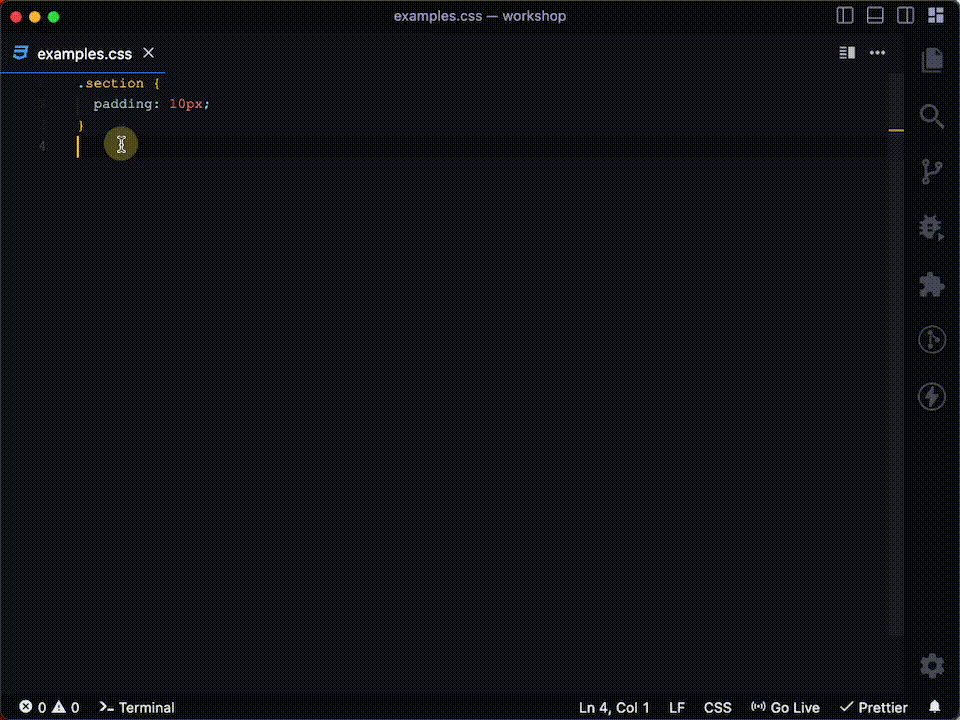

# **Quick Media**

To all the **Frontend Developers** out there, We have came up with the solution
called "**Quick Media**" to write the media queries in more faster and convinient way than usual. As we all know, maintaining the responsiveness of website, sometimes we need the help of media queries. And **Quick Media** will surely help you out to achieve the same.

## Features

---

There are four keys this extension mainly provides.

1. min-query
1. max-query
1. in-query
1. retina-query

## Usage

---

For navigation use **TAB button**



## Overview

---

> min-query

```css
@media only screen and (min-width: 480px) {
  ...;
}
```

> max-query

```css
@media only screen and (max-width: 767px) {
  ...;
}
```

> in-query

Above key will generate following css code

```css
@media only screen and (min-width: 768px) and (max-width: 1023px) {
  ...;
}
```

> retina-query

Above key will generate following css code

```css
@media (min-device-pixel-ratio: 2), (min-resolution: 192dpi), (min-resolution: 2dppx) {
  ...;
}
```

## Installation

---

You can simply [install Quick Media](https://marketplace.visualstudio.com/items?itemName=YK911.quickmedia) on your machine.

Or

Open the extension tab in VS Code and search for **Quick Media**.
